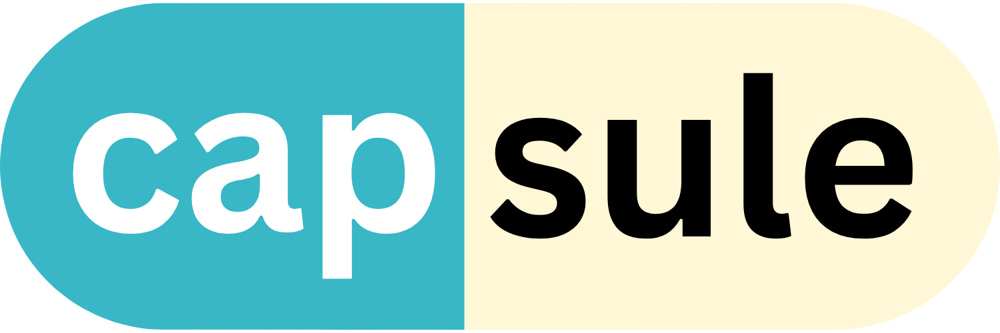

<div align="center">
  
  <p><i>Smart Medication Management for a Healthier Tomorrow</i></p>
</div>

<div align="center" style="display:flex; gap: 8px; justify-content: center; margin-bottom: 16px">
  
  
  
  
  
</div>

Capsule is a Medication Reminder and Tracker App. This application aims to assist users in managing their medications effectively. The app features a user-friendly interface, medication reminders, and an AI chatbot to help users understand their medications better.
<div style="display:flex; gap: 8px; align-items: center">
  <p>Product demo:</p>
  <a href="https://www.youtube.com/">
    
  </a> 	
</div>

## Features

- **Medication Reminders:** Set up reminders to ensure timely medication intake.
- **AI Chatbot:** Get assistance and information about your medications through the AI-powered chatbot.
- **Medication Tracking:** Keep a record of your medication history and track your progress.

## Getting Started

Follow these steps to get the app up and running on your local machine.

### Prerequisites

- Flutter installed on your machine. [Flutter Installation Guide](https://flutter.dev/docs/get-started/install)
- Android/ios emulator or a physical device

### Installation

- Clone the repository:

  ```bash
  git clone https://github.com/ACMHacettepeDevelopers/capsule-gsc
  ```

- Navigate to the project directory:
 
  ```bash
  cd capsule-gsc
  ```

- Install Dependencies:
 
  ```bash
  flutter pub get
  ```

- Get your API key from Google AI Studio:
<div align="left">
  
</div>

- Create a .env file and add your API key:
<div align="left">
  
</div>

### Usage

- Run the app on an emulator or connected device:

  ```bash
  flutter run
  ```

## Acknowledgements
- A special thanks to everyone who tested our app and provided valuable feedback
- We would like to express our gratitude to the following student clubs for their support:
  - GDSC Hacettepe University
  - ACM Hacettepe Student Chapter

